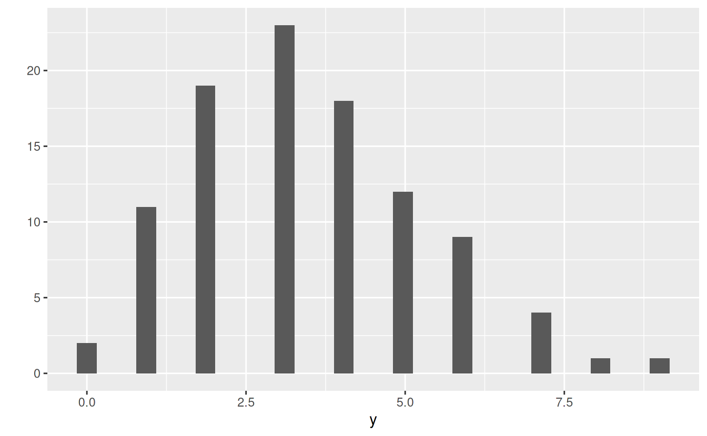
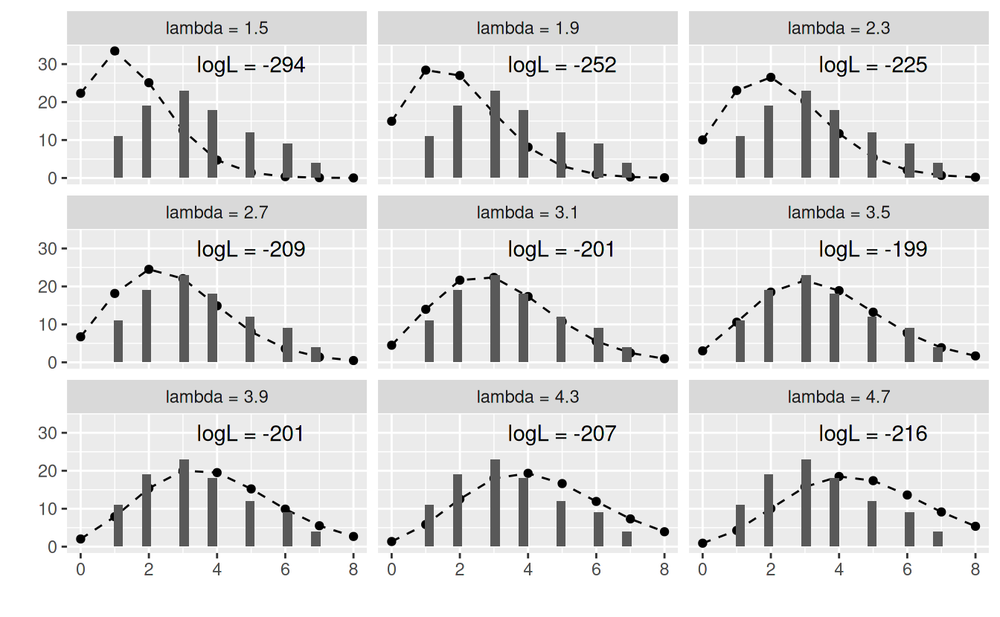
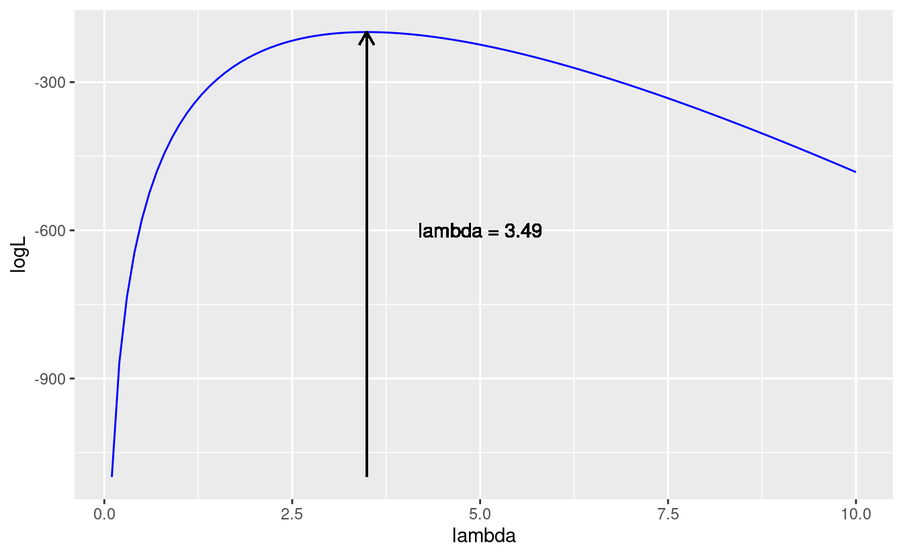
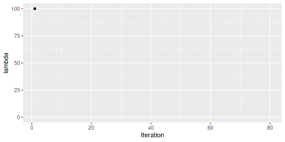

# Likelihood methods

- Estimating parameters that most likely to produce the observed data (in a given probability distribution).


## Likelihood 

- Let's consier a simple example where the obsrervaions (y) follow the Poisson distribution.

$$
y_i ~\sim Pois(\lambda) \\
$$


```
#> `stat_bin()` using `bins = 30`. Pick better value with `binwidth`.
```

<!--html_preserve--><div id="htmlwidget-983315589fed18d622a7" style="width:100%;height:auto;" class="datatables html-widget"></div>
<script type="application/json" data-for="htmlwidget-983315589fed18d622a7">{"x":{"filter":"none","data":[["1","2","3","4","5","6","7","8","9","10","11","12","13","14","15","16","17","18","19","20","21","22","23","24","25","26","27","28","29","30","31","32","33","34","35","36","37","38","39","40","41","42","43","44","45","46","47","48","49","50","51","52","53","54","55","56","57","58","59","60","61","62","63","64","65","66","67","68","69","70","71","72","73","74","75","76","77","78","79","80","81","82","83","84","85","86","87","88","89","90","91","92","93","94","95","96","97","98","99","100"],[2,5,3,6,7,1,3,6,4,3,7,3,4,4,1,6,2,1,3,7,6,4,4,9,4,4,4,4,2,2,7,6,4,5,0,3,5,2,2,2,2,3,3,3,2,2,2,3,2,6,1,3,5,1,4,2,1,5,6,3,4,1,3,2,5,3,5,5,5,3,5,4,4,0,3,2,3,4,3,1,2,4,3,5,1,3,8,6,6,2,1,4,3,4,2,2,5,1,3,3],[1,2,3,4,5,6,7,8,9,10,11,12,13,14,15,16,17,18,19,20,21,22,23,24,25,26,27,28,29,30,31,32,33,34,35,36,37,38,39,40,41,42,43,44,45,46,47,48,49,50,51,52,53,54,55,56,57,58,59,60,61,62,63,64,65,66,67,68,69,70,71,72,73,74,75,76,77,78,79,80,81,82,83,84,85,86,87,88,89,90,91,92,93,94,95,96,97,98,99,100]],"container":"<table class=\"display\">\n  <thead>\n    <tr>\n      <th> <\/th>\n      <th>y<\/th>\n      <th>ID<\/th>\n    <\/tr>\n  <\/thead>\n<\/table>","options":{"columnDefs":[{"className":"dt-right","targets":[1,2]},{"orderable":false,"targets":0}],"order":[],"autoWidth":false,"orderClasses":false}},"evals":[],"jsHooks":[]}</script><!--/html_preserve-->


- Probability of $y_i$ observed when mean = $\lambda$ 
- Likelihood L($\lambda$) = (probability of $y_1$ = 2 when mean = $\lambda$ ) $\times$ (probability of $y_2$ = 5 when mean = $\lambda$ ) $\times \cdots \times$ (probability of $y_{100}$ = 3 when mean = $\lambda$ ) 


$$
L(\lambda) = \Pi Pois(y_i | \lambda)
$$

$$
logL(\lambda) = \Sigma log(Pois(y_i | \lambda))
$$


```
#> Warning: The `x` argument of `as_tibble.matrix()` must have unique column names if `.name_repair` is omitted as of tibble 2.0.0.
#> Using compatibility `.name_repair`.
#> This warning is displayed once every 8 hours.
#> Call `lifecycle::last_warnings()` to see where this warning was generated.
#> `stat_bin()` using `bins = 30`. Pick better value with `binwidth`.
#> Warning: Removed 9 rows containing non-finite values (stat_bin).
#> Warning: Removed 2 row(s) containing missing values (geom_path).
#> Warning: Removed 18 rows containing missing values (geom_point).
#> Warning: Removed 18 rows containing missing values (geom_bar).
```



### Analytical approaches

- Maximum likelihood estimation
  - Generalized linear models (GLMs)




```r
fit <- glm(y ~ 1, family = "poisson") 
fit[[1]] %>% exp
#> (Intercept) 
#>        3.49
```


### Simulation approaches

- Markov chain Monte Carlo (MCMC)
  - Bayesian





## Linear models (LMs)

- Models assume normal distributions in their error terms.

$$
y_i \sim N(\beta_0 + \beta_1 x_i, \sigma) \\
$$

- or

$$
y_i = \beta_0 + \beta_1 x_i +\epsilon_i \\
\epsilon_i \sim N(0, \sigma)
$$

```
lm(y ~ x, data = ... )
```

## Generalized Linear models (GLMs)

- Models assume exponential family distributions (e.g., Poisson, Gamma,
  Binomial, Negative-binomial,...) in their error terms.

$$
log\lambda_i = \beta_0 + \beta_1 x_i \\
y_i \sim Pois(\lambda_i)
$$


```
# poisson distribution and log link function
glm(y ~ x, data = ..., family = "poisson")
```

## Generalized Linear mixed models (GLMMs)

### Independent errors

- Models assume exponential family distributions in their error terms 
- Error terms also have different means among groups.

$$
y_{ij} = \beta_0 + \beta_1 x_{ij} +\epsilon_i + r_j\\
\epsilon_i \sim N(0, \sigma) \\
r_j \sim N(0, \phi)
$$


```
lme4::lmer(y ~ x + (x | group), data = ...)
```

### Dependent errors

- Error terms are sometimes dependent (correlated) among groups.
- We will learn this today (if we have a time).
