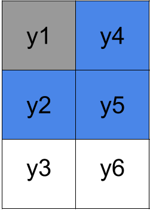

```{r global_options, include=FALSE}
knitr::opts_chunk$set(echo=TRUE,
                      warning=FALSE,
                      cache=FALSE,
                      message=FALSE)
htmltools::tagList(rmarkdown::html_dependency_font_awesome())
```

<a href="https://twitter.com/mattocci"><i class="fa fa-twitter fa-1x"></i> Twittter</a>
<a href="https://github.com/mattocci27/"><i class="fa fa-github fa-1x"></i> Github</a>
<a href="mailto:mattocci27@gmail.com"><i class="fa fa-envelope fa-1x"></i> Email</a>

Course materials for 2020-11-2 AFEC at XTBG.

# Prerequisites

```{r, eval = F}
install.packages("spdep")
```

```{r}
library(tidyverse)
library(spdep)
```

# Spatial autocorrelaiton 

- Neighbors affect the observation.


- Let's condier maps with some environmental variables (e.g., soil N, soil moisture...).
```{r, echo = TRUE}
library(spdep)

set.seed(1234)
N <- 50
x <- seq(1, 25)
y <- seq(1, 25)
#z <- matrix(numeric(length(x) * length(y)), ncol = length(y))
z <- matrix(rnorm(length(x) * length(y)), ncol = length(y))

z0 <- z
z2 <- z
for (i in 2:(length(x)-1)) {
  for (j in 2:(length(y)-1)) {
    z[i, j] <- 
      rnorm(1, 
            mean(
              c(z[i - 1, j - 1],
              z[i - 1, j],
              z[i - 1, j + 1],
              z[i, j - 1],
              z[i, j + 1],
              z[i + 1, j - 1],
              z[i + 1, j],
              z[i + 1, j + 1])),
            0)
  }
}


z_scaled <- (z - mean(as.numeric(z))) / sd(as.numeric(z))

z2 <- z
z2[z < 0] <- "ridge"
z2[z > 0] <- "valley"
#z2[z > -0.5 & z < 0.5] <- "flat"

#z2 <- z2 + z
x2 <- rep(x, length(y))
y2 <- rep(y, each = length(x))
dat <- tibble(x = x2,
              y = y2,
              mu = as.vector(z),
              hab = as.vector(z2),
              z = as.numeric(z_scaled),
              z0 = as.numeric(z0)
)

ggplot(dat, aes(x = x, y = y, fill = z0)) +
  geom_raster()
```

- Soil moisture (z0) are randomly distributed.

```{r, echo=TRUE}
dat %>% 
  # cut the edges
  filter(x > 1) %>%
  filter(x < max(x)) %>%
  filter(y > 1) %>%
  filter(y < max(y)) %>%
  ggplot(., aes(x = x, y = y, fill = z)) +
    geom_raster()
```

- Soil moisture (z) can show aggregated patterns.

```{r, echo = TRUE}
ggplot(dat, aes(x = x, y = y, fill = hab)) +
  geom_raster()
```

- Ridge sites have lower soil moisture

```{r, echo = FALSE, eval = FALSE}
ggplot(dat, aes(x = x, y = y, z = mu)) +
  geom_contour()
```

```{r, eval = FALSE, echo = FALSE}

tmp <- rmvnorm(100, c(0, 0), diag(2)) %>%
  rbind(., rmvnorm(100, c(2, 4), diag(2))) %>%
  as_tibble

moge <- expand.grid(seq(3,-3, length = 100), seq(3,-3, length = 100))

moge %>%
  mutate(p = dmvnorm(moge, c(0, 0), diag(2))) %>%
  ggplot(., aes(x = Var1, y = Var2, z = p)) +
  geom_contour()

m <- ggplot(tmp, aes(x = V1, y = V2)) +
 geom_point()

# contour lines
m + geom_density_2d()

```

```{r, echo = TRUE}
dat2 <- dat %>%
  mutate(hab_dummy = ifelse(hab == "valley", 0, 1)) %>%
  mutate(trait = rnorm(nrow(.), -mu, 0.3)) # based on z 
  #mutate(trait = rnorm(nrow(.), 2 * hab_dummy, 0.6)) # based on z 

dat2 %>%
  dplyr::select(x, y, hab, trait) %>%
  write_csv(., "./data/trait_env.csv")

dat2 %>%
  ggplot(., aes(x = hab, y = trait, col = hab)) +
  geom_violin() +
  geom_jitter(width = 0.2)
```

- Points indicate mean trait values for each grid (local community).
- Ridge sites have greater trait values (e.g., thick dense leaves to grow well in
  dry conditions)
- Is this because those traits are favored in ridge sites?
- Is this just because neighbors have similar trait values (spatial autocorrelation)?

# Spatial autoregressive models (SAR)



$$
  \left[
    \begin{array}{r}
      y_1 \\
      y_2 \\
      y_3 \\
      y_4 \\
      y_5 \\
      y_6 
    \end{array}
  \right] = \rho \left[
    \begin{array}{rrrrrr}
     0 & 1/3 & 0 & 1/3 & 1/3 & 0 \\
     1/3 & 0  &&&& \\
     0 && 0  &&& \\
     1/3 & & & 0 && \\
     1/3 & & &  & 0 & \\
     0 & & &  & & 0 
    \end{array}
  \right] \cdot  \left[
    \begin{array}{r}
      y_1 \\
      y_2 \\
      y_3 \\
      y_4 \\
      y_5 \\
      y_6 
    \end{array}
  \right] + \epsilon
$$


$$
y_1 = \rho  1/3 (y_2 + y_4 + y_5) + \epsilon
$$


In general, autoregressive models take this kind of form.

$$
Y = X \beta + \rho W Y   + \epsilon
$$

- $Y$: Dependent variable ($N \times 1$, e.g., CWM)
- $X$: Independent variable ($N \times k$, e.g., ridge (1) or valley (0))
- $\beta$: Model parameters ($k \times l$)
- $\rho$: Spatial autocorrelaiton parameter
- $W$: Spatial weight matrix ($N \times N$)
- $\epsilon$: errors ($N \times 1$)

Parameters, $\beta$, $\rho$, (variance of )$\epsilon$, can be esimated by maximum likelihood or Bayesian methods.

# R examples

- Let's apply spatial autocorrelaiton models for the above violin plot example.
- First, we need to prepare a spatial weight matrix (W).
- Then, we apply some R functions to fit $Y = X \beta + \rho W Y  + \epsilon$

## Spatial weight matrix

- Read the dataset.
```{r, echo=TRUE}
d <- read_csv("./data/trait_env.csv")
d
```

- Make a neighour list object to calcluate $W$.
- $y_1$ is next to $y_2$, $y_4$, and $y_5$.
```{r, echo=TRUE}
(nb <- cell2nb(length(unique(d$x)),length(unique(d$y)), type = "queen"))
```

- Make a spatial weight object ($W$ but list in R) 
```{r, echo=TRUE}
(W <- nb2listw(nb, zero.policy = TRUE, style = "W"))
```

## Fit

- Intercept only
```{r, echo=TRUE}
fit1 <- spautolm(trait ~ 1, listw = W, data = d)

summary(fit1)
```

- lambda (rho) = `r fit1$lambda` indicates a positve spatial autocorrelaiton


- Model with an environmetal predictor

```{r, echo=TRUE}
fit2 <- spautolm(trait ~ hab, listw = W, data = d)

summary(fit2)
```

- lambda (rho) = `r fit2$lambda` indicates a weak positve spatial autocorrelaiton
- Negative `habvalley` indicates valley sites have negative effects on trait values compared to ridge sites even after controlling spatial autocorrelaiton.


## Exercise 

- Make a raster plot for $\epsilon$.
    - `fit1$fit$residuals` is a vector of $\epsilon$.
    - What does this figure mean?  

- Make a raster plot for $\rho W Y$.
    - `fit1$fit$fitted.values` is a vector of $\rho W Y$.
    - What does this figure mean?  

- Make violin plots or box plots for $\epsilon$ and $\rho W Y$.
    - `geom_violin`, `geom_boxplot`
    - What do those figures mean?  
