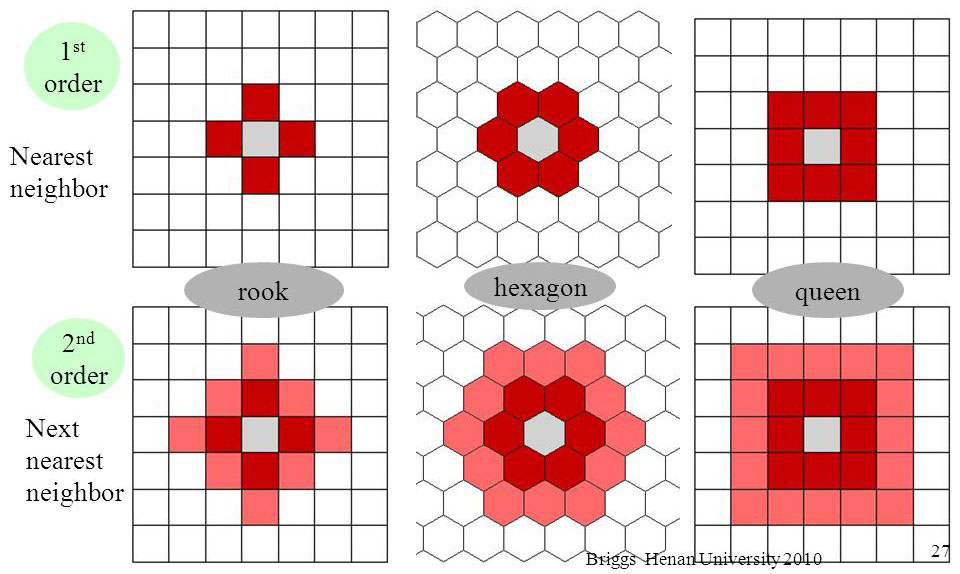

# What is autocorrelation?

[spatial](https://spatialanalysis.github.io/workshop-notes/spatial-autocorrelation.html#spatial-autocorrelation-1)


```{r message = FALSE, warning = FALSE}
library(tidyverse)
```

## Simple correlation

- A variable y is correlated with a variable x and its slope is $\beta_1$
- In likelihood methods, this statement can be written as:

$$
y_i \sim N(\beta_0 + \beta_1 x_i, \sigma) \\
$$

- or

$$
y_i = \beta_0 + \beta_1 x_i +\epsilon_i \\
\epsilon_i \sim N(0, \sigma)
$$

We have three parameters $\beta_0, \beta_1, \sigma$ in this simple linear model. 


```{r}
set.seed(1234)
N <- 50
beta0 <- 2
beta1 <- 0.8
sigma <- 0.3

x <- rnorm(N, 0, 1)
y <- rnorm(N, beta0 + beta1 * x, sigma)

dat <- tibble(x, y, n = seq(1, N))

ggplot(dat, aes(x = x , y = y)) +
  geom_point()

dat %>%
  gather(xy, val, 1:2) %>%
  ggplot(., aes(x = n , y = val, col = xy)) +
  geom_point() +
  geom_line()

cor.test(x, y)
```

## One dimensional autocorrelation

- Previous observation(s) affects the current observation.
- Temporal autocorrelation is this type of the autocorrelation.


$$
x_i = \mu_x +\epsilon_{xi} \\
y_i = \mu_y +\epsilon_{yi} \\
\epsilon_{y,i+1} \sim N(\epsilon_{y,i}, \phi_y) \\
\epsilon_{x,i+1} \sim N(\epsilon_{x,i}, \phi_x)
$$


```{r}
N <- 50
x <- y <- NULL
x[1] <- 0
y[1] <- 0

for (i in 1:(N-1)) {
  y[i + 1] <- rnorm(1, y[i], 0.8)
  x[i + 1] <- rnorm(1, x[i], 0.8)
}

dat <- tibble(x, y, n = seq(1, N))

ggplot(dat, aes(x = x , y = y)) +
  geom_point()

dat %>%
  gather(xy, val, 1:2) %>%
  ggplot(., aes(x = n , y = val, col = xy)) +
  geom_point() +
  geom_line()

cor.test(x, y)
```

- We got a strong correlation for the two variables that are supposed to be
  independent.

```{r}

N <- 50
r <- NULL
for (j in 1:200) {
  x <- y <- NULL
  x[1] <- 0
  y[1] <- 0

  for (i in 1:(N-1)) {
    y[i + 1] <- rnorm(1, y[i], 0.8)
    x[i + 1] <- rnorm(1, x[i], 0.8)
  }
  r[j] <- cor(x, y)
}

qplot(r)

```


```{r, echo=FALSE}
ggplot(dat, aes(x = x , y = y)) +
  geom_point() +
  ylab("Photosynthetic rates") +
  xlab("Respiration rates") +
  theme(
    axis.text = element_blank()
  )
```

- Each point shows daily measurements
- Do you believe this?

```{r, echo=FALSE}
ggplot(dat, aes(x = x , y = y)) +
  geom_point() +
  ylab("Photosynthetic rates") +
  xlab("Apple stock price") +
  theme(
    axis.text = element_blank()
  )

```

- Do you believe this?

## Two dimensional autocorrelation

- Neighbors affect the current observation.
- Spatial autocorrelation is this type of the autocorrelation.



$$
Y = X \beta + \rho W (Y - X \beta)  + \epsilon
$$

```{r}
library(spdep)
library(Matrix)

set.seed(1234)
N <- 50
x <- seq(1, 25)
y <- seq(1, 25)

nb <- cell2nb(length(x),length(y), type = "queen")
W <- nb2listw(nb, zero.policy = TRUE, style = "W")
B <- nb2mat(nb, zero.policy = TRUE, style = "W")

#z <- matrix(numeric(length(x) * length(y)), ncol = length(y))
z <- matrix(rnorm(length(x) * length(y)), ncol = length(y))

automean2<-function(metric){	
#queen?equal weighting 1/8
d.W<-nb2listw(d.nb, zero.policy=TRUE,style="W")
#SAR
a<-spautolm(metric~ 1,listw=d.W,na.action=na.omit)
return(a$fit$fitted.values)
}

z0 <- z
z2 <- z
for (i in 2:(length(x)-1)) {
  for (j in 2:(length(y)-1)) {
    z[i, j] <- 
      rnorm(1, 
            mean(
              c(z[i - 1, j - 1],
              z[i - 1, j],
              z[i - 1, j + 1],
              z[i, j - 1],
              z[i, j + 1],
              z[i + 1, j - 1],
              z[i + 1, j],
              z[i + 1, j + 1])),
            0)
  }
}


z_scaled <- (z - mean(as.numeric(z))) / sd(as.numeric(z))

z2 <- z
z2[z > 0] <- "ridge"
z2[z < 0] <- "valley"
#z2[z > -0.5 & z < 0.5] <- "flat"

#z2 <- z2 + z
x2 <- rep(x, length(y))
y2 <- rep(y, each = length(x))
dat <- tibble(x = x2,
              y = y2,
              mu = as.vector(z),
              hab = as.vector(z2),
              z = as.numeric(z_scaled),
              z0 = as.numeric(z0)
)

ggplot(dat, aes(x = x, y = y, fill = z0)) +
  geom_raster()
```


```{r}
dat %>% 
  # cut the edges
  filter(x > 1) %>%
  filter(x < max(x)) %>%
  filter(y > 1) %>%
  filter(y < max(y)) %>%
  ggplot(., aes(x = x, y = y, fill = z)) +
    geom_raster()
```

```{r}
ggplot(dat, aes(x = x, y = y, fill = hab)) +
  geom_raster()
```

```{r}
ggplot(dat, aes(x = x, y = y, z = mu)) +
  geom_contour()
```

```{r, eval = F}

tmp <- rmvnorm(100, c(0, 0), diag(2)) %>%
  rbind(., rmvnorm(100, c(2, 4), diag(2))) %>%
  as_tibble

moge <- expand.grid(seq(3,-3, length = 100), seq(3,-3, length = 100))

moge %>%
  mutate(p = dmvnorm(moge, c(0, 0), diag(2))) %>%
  ggplot(., aes(x = Var1, y = Var2, z = p)) +
  geom_contour()

m <- ggplot(tmp, aes(x = V1, y = V2)) +
 geom_point()

# contour lines
m + geom_density_2d()

```


```{r}
dat2 <- dat %>%
#  mutate(hab_dummy = ifelse(hab == "valley", 0, 1)) %>%
  mutate(trait = rnorm(nrow(.), mu, 0.3)) # based on z 

dat2 %>%
  ggplot(., aes(x = hab, y = trait, col = hab)) +
  geom_violin() +
  geom_jitter(width = 0.2)
```

- Ridge sites have greater trait values (e.g., thick dense leaves to grow well in
  dry conditions)
- Is this because those traits are favored in ridge sites?
- Is this just because neighbors have similar trait values (spatial autocorrelation)?

